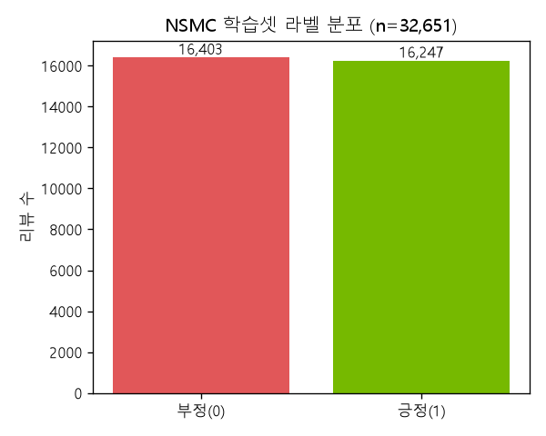
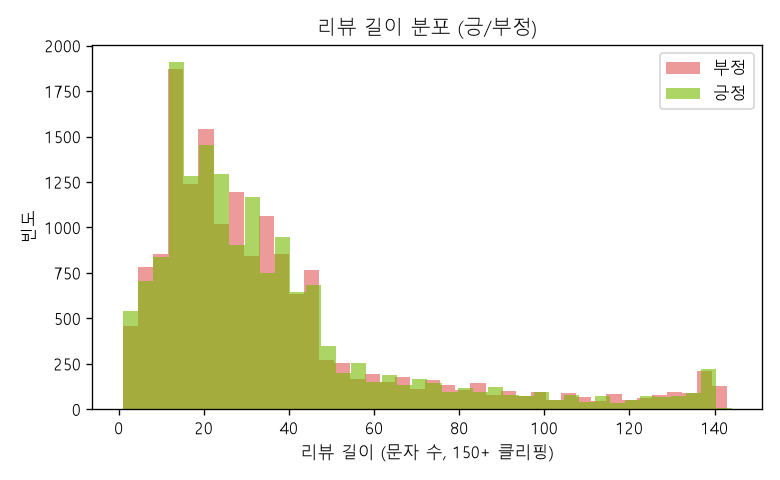

# 한국어 영화 리뷰 감성 분석 (Korean Movie Review Sentiment Analysis)
### LSTM + 한국어 형태소 분석 기반 이진 감성 분류

> **English summary**
> An end-to-end Korean sentiment-analysis pipeline built on the NSMC (Naver Sentiment Movie Corpus) style dataset. Raw movie reviews are cleaned with regex, tokenized with the **Okt** Korean morphological analyzer (KoNLPy), filtered for stopwords, converted to integer sequences via a Keras `Tokenizer` (vocabulary size 11,775), and padded to length 30. A compact **Embedding → LSTM → sigmoid** network then learns to classify each review as positive or negative. The project deliberately keeps every stage of the pipeline as a separate, readable script so the flow from raw Korean text to a trained classifier is fully transparent.


---

## 개요 / 문제 정의

한국어 텍스트는 교착어 특성상 조사·어미가 어간에 붙어 변형되기 때문에, 영어처럼 공백 단위로 토큰화하면 같은 의미의 단어가 서로 다른 토큰으로 흩어집니다. 이 프로젝트는 그 문제를 **형태소 분석 기반 토큰화**로 정면 돌파합니다.

- **목표**: 영화 리뷰 문장을 입력받아 **긍정(1) / 부정(0)** 을 예측하는 이진 감성 분류기 학습
- **핵심 도전 과제**:
 - 한국어 형태소 분석(Okt)으로 어간을 정규화(`stem=True`)해 어휘 폭발 억제
 - 불용어(조사·의미 없는 접속사) 제거로 노이즈 감소
 - 정수 인코딩 후 **빈 시퀀스가 되는 저빈도 문장을 정리**하는 데이터 위생 처리
- **접근**: 전처리 파이프라인을 단계별 스크립트로 분리 → 각 단계 산출물(CSV)을 다음 단계 입력으로 넘기는 재현 가능한 구조

## 데이터셋

- **출처**: NSMC 계열 영화 리뷰 데이터 (`ratings_train.csv`, 탭 구분 `\t`, `quoting=3`)
- **컬럼**: `id`, `document`(리뷰 원문), `label`(0=부정 / 1=긍정)
- **전처리 후 규모** (코드 주석 기준):
 - 결측·중복 제거 후 약 **32,163개** 유효 리뷰
 - 정수 인코딩 후 빈 시퀀스 제거 → 최종 훈련 **~31,901개**, 테스트 **~31,554개** 샘플
- **시퀀스 통계** (코드 주석 기준): 최대 길이 63, 평균 길이 약 10.7 토큰 → **패딩 길이 30**으로 통일
- **어휘 크기**: 전체 21,800개 이상의 고유 단어 중 빈도 기준 상위 **11,775개**만 사용 (index 0은 패딩 예약)

## 방법론

### 파이프라인

```mermaid
flowchart LR
    A[원시 리뷰<br/>ratings_train.csv] --> B[결측·중복 제거<br/>label int 변환]
    B --> C[정규식 필터링<br/>한글·공백만 남김]
    C --> D[Okt 형태소 분석<br/>morphs stem=True]
    D --> E[불용어 제거]
    E --> F[Keras Tokenizer<br/>vocab=11775]
    F --> G[정수 인코딩<br/>texts_to_sequences]
    G --> H[빈 시퀀스 행 제거]
    H --> I[pad_sequences<br/>maxlen=30]
    I --> J[Embedding → LSTM → Dense]
    J --> K[이진 감성 예측]
```



### 단계별 상세

| 단계 | 스크립트 | 핵심 처리 |
|------|----------|-----------|
| ① 원시 전처리 | `한국영화리뷰_데이터_전처리.py` | `dropna`, `drop_duplicates`, 정규식 `[^ㄱ-힣\s]` 제거, Okt `morphs(stem=True)` + 불용어 제거 후 `document` 재구성 |
| ② 형태소 분석 실습 | `한글_형태소분석.py` | Okt `morphs(norm=True, stem=True)` 동작 확인용 최소 예제 |
| ③ 토큰화·정수 인코딩 | `6.리뷰데이터_단어집합크기적용_토큰화_정수인코딩.py` | `Tokenizer(11775)` 학습, `texts_to_sequences`, 빈 시퀀스 행 제거, `pad_sequences(maxlen=30)` |
| ④ 전처리+인코딩 통합 | `한국영화리뷰_데이터전처리_1.py` | ③과 동일 인코딩을 CSV 입력 기준으로 재현 (학습 직전 데이터 준비) |
| ⑤ LSTM 학습 | `한국영화리뷰_LSTM모델학습.py` | 모델 설계·컴파일·콜백·`fit` |

### 모델 아키텍처 (`한국영화리뷰_LSTM모델학습.py`)

```
Input(shape=(30,))
Embedding(input_dim=11775, output_dim=100)   # 100차원 밀집 임베딩
LSTM(128)                                     # 은닉 유닛 128
Dense(1, activation='sigmoid')                # 이진 분류 출력
```

- **손실 함수**: `binary_crossentropy`
- **옵티마이저**: `Adam(learning_rate=1e-4)`
- **배치 크기**: 64 / **에폭**: 최대 50 (조기 종료로 실제로는 더 짧음)
- **콜백**:
 - `EarlyStopping(monitor='val_loss', patience=4, restore_best_weights=True)`
 - `ModelCheckpoint('movie_review_bestmodel.keras', save_best_only=True)`

> 설계 의도: 임베딩 차원(100)과 LSTM 유닛(128)을 과하지 않게 잡고, 낮은 학습률(1e-4)로 안정적으로 수렴시키며 조기 종료로 과적합을 방지합니다.

## 결과

### 데이터 탐색 (실제 NSMC 학습셋 시각화)

LSTM 학습에 앞서 실제 NSMC 데이터(`ratings_train`, 15만 리뷰)를 분석한 결과입니다. (`results/`)

| 라벨 분포 (긍/부정 균형) | 리뷰 길이 분포 |
|:---:|:---:|
|  |  |

긍정/부정 라벨이 거의 균형을 이뤄 별도 리샘플링이 불필요하며, 리뷰 길이는 대부분 40자 이내에 몰려 있어 **`maxlen=30` 패딩 설정의 근거**가 됩니다.

### 모델 학습 산출물

- `movie_review_bestmodel.keras` — 검증 손실 기준 최적 가중치 스냅샷
- `model.fit`의 `history` — 에폭별 `loss`/`accuracy`/`val_loss`/`val_accuracy` 곡선
- 검증 데이터로 매 에폭 성능 측정

> 위 EDA 그림은 `make_figures.py`(pandas+matplotlib)의 실제 출력입니다. LSTM 정확도 수치는 학습 환경에 따라 달라져 별도 표기하지 않습니다.

## 실행 방법

### 1. 사전 준비 — KoNLPy와 JDK

`konlpy`의 `Okt`는 내부적으로 **Java(JVM)** 를 사용합니다. 반드시 **JDK 설치 및 `JAVA_HOME` 설정**이 선행되어야 합니다.

```bash
# (예시) JDK 설치 후 환경변수 확인
java -version
echo $JAVA_HOME    # Windows: echo %JAVA_HOME%
```

Windows에서는 `konlpy` 설치 시 `JPype1`도 함께 필요할 수 있습니다.

### 2. 의존성 설치

```bash
pip install -r requirements.txt
```

### 3. 파이프라인 실행 (순서대로)

```bash
# ① 원시 리뷰 → 형태소 분석·불용어 제거
python src/한국영화리뷰_데이터_전처리.py

# ② (선택) 형태소 분석 동작 확인
python src/한글_형태소분석.py

# ③ 토큰화·정수 인코딩·패딩
python src/6.리뷰데이터_단어집합크기적용_토큰화_정수인코딩.py

# ④ 학습 데이터 준비 + LSTM 학습
python src/한국영화리뷰_LSTM모델학습.py
```

> 스크립트 내 CSV 경로는 개발 환경 기준 절대 경로(`/home/sckit/...`)로 되어 있으니, 로컬 데이터 위치에 맞게 경로만 수정하세요.

## 배운 점

- **형태소 분석의 필요성**: 한국어에서 `stem=True`로 어간을 정규화하면 어휘 수가 크게 줄고, 같은 의미 단어가 하나의 토큰으로 모여 임베딩 학습이 안정화됩니다.
- **어휘 크기(num_words)의 트레이드오프**: 상위 11,775개로 제한하면 저빈도 노이즈는 줄지만, 일부 문장이 통째로 빈 시퀀스가 됩니다 → **빈 시퀀스 행을 반드시 제거**해야 학습이 깨지지 않습니다.
- **시퀀스 길이 통계 기반 패딩**: 최대(63)가 아닌 평균(~10.7)을 고려해 `maxlen=30`으로 잡아 메모리와 정보량의 균형을 맞췄습니다.
- **낮은 학습률 + 조기 종료**: `1e-4` 학습률과 `patience=4` 조기 종료 조합으로 과적합 없이 안정적으로 수렴시키는 감각을 익혔습니다.

## 참고

- [`nlp`](https://github.com/NvidiaSeoul/nlp) — Naive Bayes·워드 임베딩·SimpleRNN 등 NLP 기초. 본 저장소의 임베딩/시퀀스 개념의 토대
- IMDB 영어 리뷰 감성 분석(SimpleRNN)은 `nlp` 저장소의 `imdb_simplernn_모델설계.py` 참고 — 본 프로젝트의 한국어 LSTM과 대비되는 케이스
- [`deep-learning-keras`](https://github.com/NvidiaSeoul) — Keras 모델 설계·콜백·전이학습 기초

---

> NVIDIA AI Academy Seoul · Cohort 1 포트폴리오의 일부 — [전체 보기](https://github.com/NvidiaSeoul)
